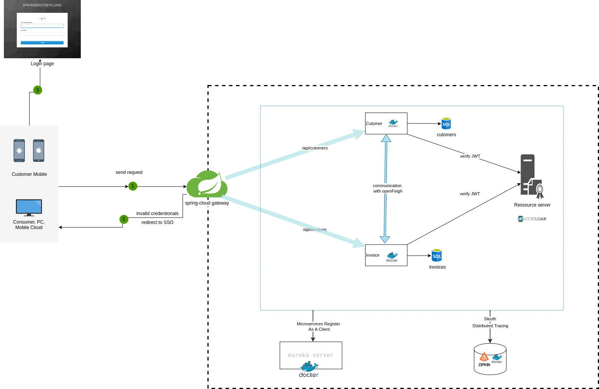

<h1 align="center">Implementation of microservice with Spring cloud</h1>

<div align="center" id="top"> 


&#xa0;


</div>

<p align="center">
  

  

  

  

   

   

   
</p>

 <h4 align="center"> 
	🚧  microservice-demo 🚀 Under construction...  🚧
</h4> 

<hr> 

<p align="center">
  <a href="#dart-about">About</a> &#xa0; | &#xa0; 
  <a href="#sparkles-features">Features</a> &#xa0; | &#xa0;
  <a href="#rocket-technologies">Technologies</a> &#xa0; | &#xa0;
  <a href="#white_check_mark-requirements">Requirements</a> &#xa0; | &#xa0;
  <a href="#checkered_flag-starting">Starting</a> &#xa0; | &#xa0;
  <a href="#memo-license">License</a> &#xa0; | &#xa0;
  <a href="https://github.com/abdelouahedd" target="_blank">Author</a>
</p>

<br>

## :dart: About ##

Microservices mean separate the project to small services,building small,self-contained,ready to run application.
In monolithic architecture we have one project that contains multiple components that becomes a large application that has many disadvantages.
For example, if a monolithic application down, the entire application will be down. Even it’s difficult to maintain a large monolithic application.

Microservices break a large application to different smaller part, so it is easy to detect the problem and maintain it. and also if a component goes down
it will not affect the whole application.

my repository contains a small project of management customers and invoices, and I am using microservice architecture with spring cloud.


## :sparkles: Features ##

:heavy_check_mark: Feature 1; create eureka service <br>
:heavy_check_mark: Feature 2; create spring cloud gateway<br>
:heavy_check_mark: Feature 3; create customer service<br>
:heavy_check_mark: Feature 4; create invoice service<br>
:heavy_check_mark: Feature 5; configure authentication service with keycloak and openId<br>
:heavy_check_mark: Feature 6; dockerized all service and manage the containers using docker compose<br>

## :rocket: Technologies ##

The following tools were used in this project:

- [Java](https://www.java.com/fr/)
- [Docker](https://www.docker.com/)
- [Spring boot](https://spring.io/projects/spring-boot)
- [Spring cloud](https://spring.io/projects/spring-cloud)
- [Spring security](https://spring.io/projects/spring-security)
- [keycloak](https://www.keycloak.org/)

## :white_check_mark: Requirements ##

Before starting :checkered_flag:, you need to have [Git](https://git-scm.com) and  [Docker](https://www.docker.com/)
installed.

## :checkered_flag: Starting ##

```bash
# Clone this project
$ git clone https://github.com/abdelouahedd/microservice-demo

# Access
$ cd microservice-demo

# Run the project
$ ./start.sh

# The server will initialize in the <http://localhost:8761>
```

## :memo: License ##

This project is under license from MIT. For more details, see the [LICENSE](LICENSE.md) file.

Made with :heart: by <a href="https://github.com/abdelouahedd" target="_blank">Abdelouahed</a>

&#xa0;

## Contributions ##
If it's your first contribution to a public Github repo follow [this](https://github.com/firstcontributions/first-contributions).<br>

Otherwise Just<br>

Pick an issue.<br>
Check if someone is already working on it (read the comments) <br>
Let everyone know that you are working on the issue (Add a comment expressing that)<br>
Thank you for your contribution.<br>

<a href="#top">Back to top</a>
